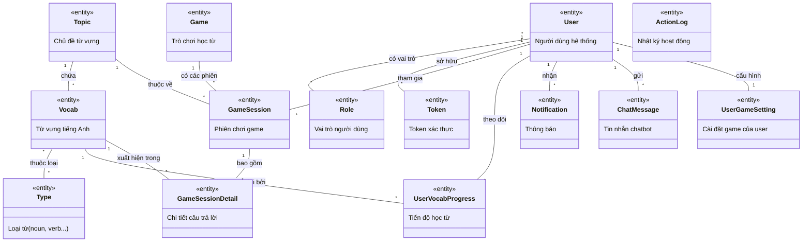
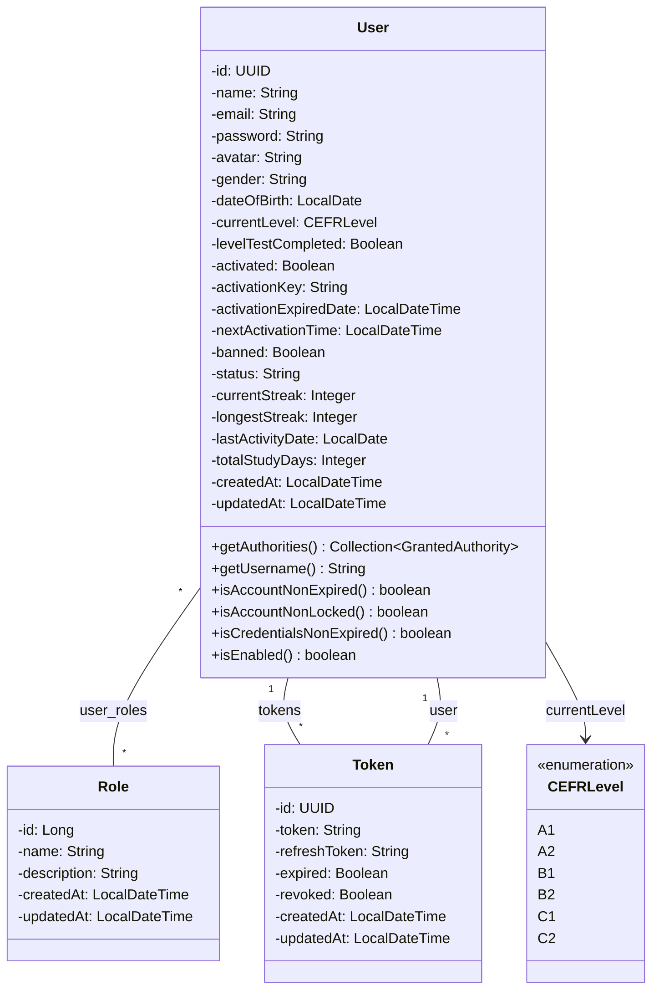
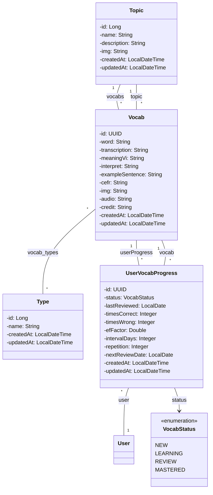
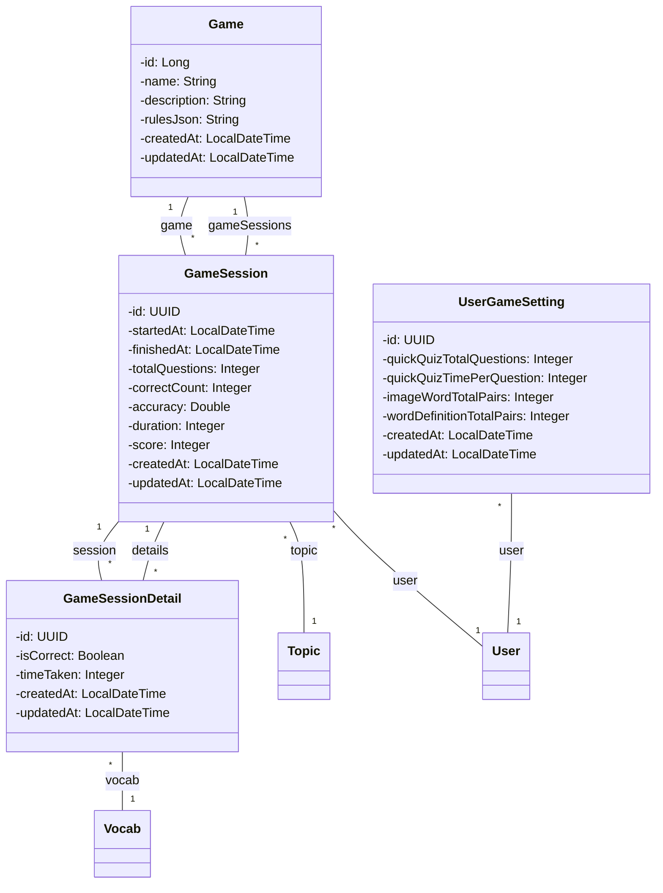
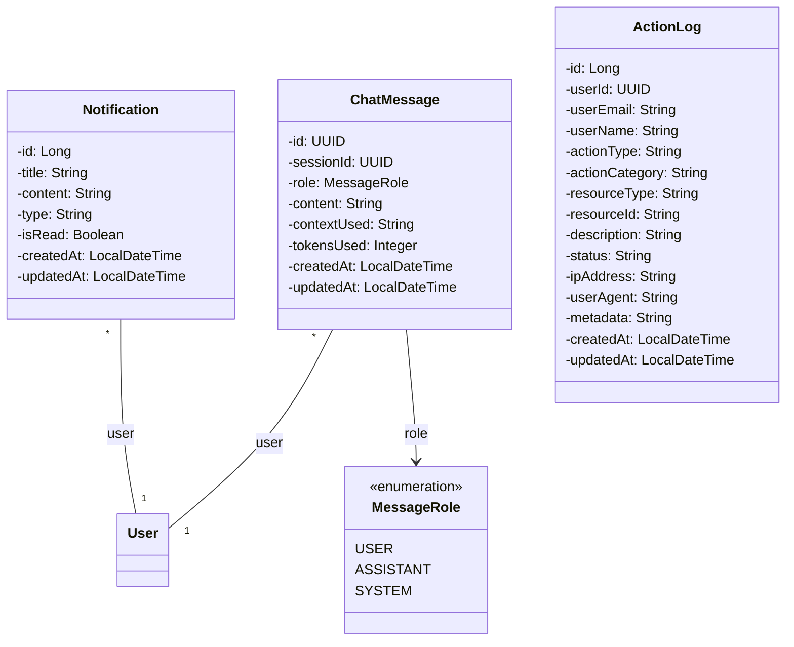
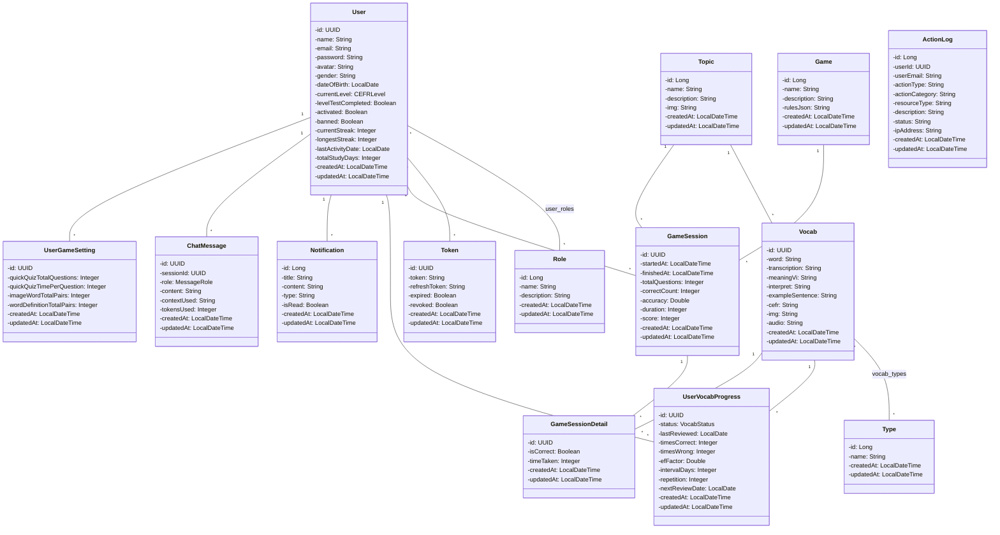
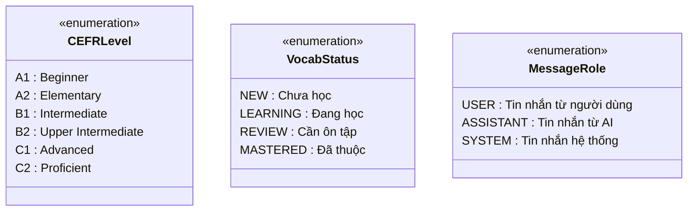

# SƠ ĐỒ LỚP - HỆ THỐNG CARD WORDS

## 1. Sơ Đồ Lớp Mức Phân Tích (Analysis Class Diagram)

Sơ đồ mức phân tích tập trung vào các khái niệm nghiệp vụ chính, không chi tiết thuộc tính và phương thức.

---

## 2. Sơ Đồ Lớp Mức Thiết Kế (Design Class Diagram)

Sơ đồ mức thiết kế chi tiết với đầy đủ thuộc tính, kiểu dữ liệu và quan hệ.

### 2.1. Quản Lý Người Dùng & Phân Quyền

### 2.2. Quản Lý Từ Vựng & Chủ Đề

### 2.3. Hệ Thống Game & Phiên Chơi

### 2.4. Hệ Thống Thông Báo & Chat

---

## 3. Sơ Đồ Lớp Tổng Hợp (Complete Design Class Diagram)

---

## 4. Mô Tả Chi Tiết Các Lớp

### 4.1. Quản Lý Người Dùng

| Lớp     | Mô tả                                                | Kiểu ID |
| ------- | ---------------------------------------------------- | ------- |
| `User`  | Người dùng, implements UserDetails (Spring Security) | UUID    |
| `Role`  | Vai trò (ADMIN, USER)                                | Long    |
| `Token` | JWT Token và Refresh Token                           | UUID    |

### 4.2. Quản Lý Từ Vựng

| Lớp                 | Mô tả                                           | Kiểu ID |
| ------------------- | ----------------------------------------------- | ------- |
| `Topic`             | Chủ đề từ vựng (Food, Animals, Technology...)   | Long    |
| `Vocab`             | Từ vựng tiếng Anh với nghĩa, phiên âm, hình ảnh | UUID    |
| `Type`              | Loại từ (noun, verb, adjective...)              | Long    |
| `UserVocabProgress` | Tiến độ học từ của user (SM-2 algorithm)        | UUID    |

### 4.3. Hệ Thống Game

| Lớp                 | Mô tả                                           | Kiểu ID |
| ------------------- | ----------------------------------------------- | ------- |
| `Game`              | Định nghĩa game (Quick Quiz, Image Matching...) | Long    |
| `GameSession`       | Phiên chơi game của user                        | UUID    |
| `GameSessionDetail` | Chi tiết từng câu trả lời trong game            | UUID    |
| `UserGameSetting`   | Cài đặt game cá nhân hóa                        | UUID    |

### 4.4. Thông Báo & Logging

| Lớp            | Mô tả                      | Kiểu ID |
| -------------- | -------------------------- | ------- |
| `Notification` | Thông báo push cho user    | Long    |
| `ChatMessage`  | Tin nhắn chatbot AI        | UUID    |
| `ActionLog`    | Nhật ký hoạt động hệ thống | Long    |

---

## 5. Enumerations (Kiểu Liệt Kê)

---

## 6. Quan Hệ Giữa Các Lớp

### 6.1. Quan Hệ 1-N (One-to-Many)

| Lớp Cha     | Lớp Con           | Mô tả                               |
| ----------- | ----------------- | ----------------------------------- |
| User        | Token             | 1 user có nhiều token               |
| User        | GameSession       | 1 user có nhiều phiên game          |
| User        | UserVocabProgress | 1 user theo dõi nhiều từ            |
| User        | Notification      | 1 user nhận nhiều thông báo         |
| User        | ChatMessage       | 1 user gửi nhiều tin nhắn           |
| User        | UserGameSetting   | 1 user có nhiều cài đặt game        |
| Topic       | Vocab             | 1 topic chứa nhiều từ               |
| Topic       | GameSession       | 1 topic có nhiều phiên game         |
| Game        | GameSession       | 1 game có nhiều phiên               |
| GameSession | GameSessionDetail | 1 phiên có nhiều chi tiết           |
| Vocab       | UserVocabProgress | 1 từ được nhiều user theo dõi       |
| Vocab       | GameSessionDetail | 1 từ xuất hiện trong nhiều chi tiết |

### 6.2. Quan Hệ N-N (Many-to-Many)

| Lớp A | Lớp B | Bảng Trung Gian | Mô tả                                         |
| ----- | ----- | --------------- | --------------------------------------------- |
| User  | Role  | user_roles      | 1 user có nhiều role, 1 role thuộc nhiều user |
| Vocab | Type  | vocab_types     | 1 từ có nhiều loại, 1 loại có nhiều từ        |

---

## 7. Stereotypes Sử Dụng

| Stereotype        | Ý nghĩa                      |
| ----------------- | ---------------------------- |
| `<<entity>>`      | Lớp thực thể (domain object) |
| `<<abstract>>`    | Lớp trừu tượng               |
| `<<interface>>`   | Interface                    |
| `<<enumeration>>` | Kiểu liệt kê                 |

---

## 8. Tổng Kết

### Thống Kê Lớp

| Nhóm                   | Số lượng | Lớp                                                   |
| ---------------------- | -------- | ----------------------------------------------------- |
| User Management        | 3        | User, Role, Token                                     |
| Vocabulary             | 4        | Topic, Vocab, Type, UserVocabProgress                 |
| Game System            | 4        | Game, GameSession, GameSessionDetail, UserGameSetting |
| Notification & Logging | 3        | Notification, ChatMessage, ActionLog                  |
| Enumerations           | 3        | CEFRLevel, VocabStatus, MessageRole                   |
| **Tổng cộng**          | **17**   |                                                       |

### Đặc Điểm Thiết Kế

1. **Standalone Entities**: Mỗi entity là một lớp độc lập với đầy đủ thuộc tính (id, createdAt, updatedAt)
2. **Encapsulation**: Các thuộc tính private, getter/setter qua Lombok
3. **Quan hệ**: Sử dụng JPA annotations để định nghĩa quan hệ
4. **Indexing**: Đánh index cho các trường thường xuyên query
5. **Audit**: Tự động tracking createdAt, updatedAt với @CreationTimestamp và @UpdateTimestamp
6. **ID Generation**: UUID sử dụng GenerationType.UUID, Long sử dụng GenerationType.IDENTITY

---

_Tài liệu được tạo tự động từ source code domain layer_  
_Ngày tạo: 27/11/2025_
