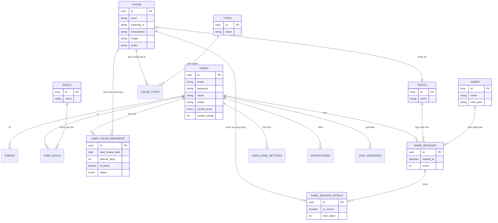

# Tài liệu Cấu trúc Cơ sở dữ liệu

Tài liệu này mô tả cấu trúc cơ sở dữ liệu cho nền tảng Card Words, bao gồm cấu trúc bảng, các mối quan hệ và mô tả các trường dữ liệu.

## Tổng quan

Cơ sở dữ liệu được thiết kế để hỗ trợ nền tảng học từ vựng với các tính năng như:
- Quản lý người dùng và xác thực (JWT, OAuth2).
- Quản lý từ vựng (Từ, Chủ đề, Loại từ).
- Hệ thống Lặp lại Ngắt quãng (SRS) để theo dõi việc học.
- Trò chơi hóa (Phiên chơi, điểm số, bảng xếp hạng).
- Nhật ký hệ thống và thông báo.
- Lịch sử tương tác với AI Chatbot.

## Sơ đồ Quan hệ Thực thể (ERD)

## Mối Quan Hệ Chính & Luồng Dữ Liệu

Phần này giải thích chi tiết các mối quan hệ quan trọng giữa các bảng để hỗ trợ các tính năng nghiệp vụ chính.

### 1. Theo Dõi Tiến Độ Học Tập (Spaced Repetition)
Mối quan hệ: **`users` ↔ `user_vocab_progress` ↔ `vocab`**

Đây là cốt lõi của tính năng Lặp lại Ngắt quãng (SRS).
- Một **User** học nhiều **Vocab**.
- Thay vì liên kết trực tiếp, bảng trung gian **`user_vocab_progress`** được sử dụng để lưu trạng thái học tập riêng biệt của từng người dùng đối với từng từ vựng.
- **Ví dụ:** Người dùng A đang học từ "Hello". Bảng `user_vocab_progress` sẽ lưu:
    - `user_id`: ID của A
    - `vocab_id`: ID của từ "Hello"
    - `status`: "LEARNING" (Đang học)
    - `next_review_date`: Ngày mai (dựa trên thuật toán SM-2)
    - `ef_factor`: 2.5 (Độ khó hiện tại)

### 2. Lịch Sử Chơi Game & Kết Quả
Mối quan hệ: **`users` ↔ `game_sessions` ↔ `game_session_details` ↔ `vocab`**

Hệ thống lưu trữ chi tiết từng lượt chơi để phân tích hiệu suất và cải thiện thuật toán gợi ý từ.
- **`users` ↔ `game_sessions`**: Một người dùng có thể chơi nhiều phiên game (`game_sessions`). Mỗi phiên lưu tổng điểm, thời gian bắt đầu/kết thúc.
- **`game_sessions` ↔ `game_session_details`**: Một phiên chơi bao gồm nhiều câu hỏi/lượt trả lời. Bảng `game_session_details` lưu chi tiết từng câu hỏi đó.
- **`game_session_details` ↔ `vocab`**: Mỗi câu hỏi trong game thường liên quan đến một từ vựng cụ thể. Điều này giúp hệ thống biết người dùng hay sai ở từ nào để gợi ý ôn tập thêm.

### 3. Tổ Chức Từ Vựng
Mối quan hệ: **`topics` ↔ `vocab` ↔ `types`**

- **`topics` ↔ `vocab`**: Một chủ đề (Topic) chứa nhiều từ vựng. Ví dụ: Topic "Travel" chứa các từ "Passport", "Ticket". (Quan hệ 1-N).
- **`vocab` ↔ `types`**: Một từ vựng có thể thuộc nhiều loại từ (Danh từ, Động từ). Ví dụ: "Run" vừa là Động từ (chạy) vừa là Danh từ (sự chạy). Do đó cần bảng trung gian `vocab_types`.

### 4. Phân Quyền Người Dùng
Mối quan hệ: **`users` ↔ `user_roles` ↔ `roles`**

- Sử dụng mô hình RBAC (Role-Based Access Control).
- Một người dùng có thể có nhiều vai trò (ví dụ: vừa là USER vừa là ADMIN).
- Bảng `user_roles` liên kết `users` và `roles` để thực hiện điều này.

### 5. Bảo Mật & Phiên Đăng Nhập
Mối quan hệ: **`users` ↔ `tokens`**

- Hệ thống sử dụng cơ chế JWT (JSON Web Token) để xác thực.
- Bảng **`tokens`** lưu trữ các Refresh Token được phát hành cho người dùng.
- Khi Access Token hết hạn, client sẽ dùng Refresh Token trong bảng này để xin cấp lại Access Token mới mà không cần người dùng đăng nhập lại.
- Quan hệ 1-N: Một người dùng có thể đăng nhập trên nhiều thiết bị, mỗi thiết bị sẽ có một Refresh Token riêng.

### 6. Hệ Thống Thông Báo & Chat AI
Mối quan hệ: **`users` ↔ `notifications`** và **`users` ↔ `chat_messages`**

- **`users` ↔ `notifications`**: Hệ thống gửi thông báo (nhắc nhở học tập, tin tức cập nhật) cho người dùng. Bảng `notifications` lưu trữ nội dung và trạng thái đã đọc/chưa đọc của từng thông báo cho từng user.
- **`users` ↔ `chat_messages`**: Lưu trữ lịch sử trò chuyện giữa người dùng và AI Chatbot. Mỗi tin nhắn được gắn với một `session_id` để nhóm các tin nhắn thành một cuộc hội thoại, giúp AI hiểu ngữ cảnh.

### 7. Cấu Hình Cá Nhân & Nhật Ký Hệ Thống
Mối quan hệ: **`users` ↔ `user_game_settings`** và **`users` ↔ `action_logs`**

- **`users` ↔ `user_game_settings`**: Mỗi người dùng có thể tùy chỉnh trải nghiệm game của mình (ví dụ: thời gian trả lời câu hỏi, số lượng câu hỏi mỗi lần chơi). Bảng này lưu các cấu hình đó. Quan hệ 1-1 (mỗi user có 1 bộ setting).
- **`users` ↔ `action_logs`**: Để phục vụ việc kiểm toán (audit) và debug, mọi hành động quan trọng của người dùng (đăng nhập, tạo từ mới, cập nhật profile) đều được ghi lại vào bảng `action_logs` kèm theo thời gian và địa chỉ IP.

## Mô tả Bảng

### 1. Quản lý Người dùng

#### `users`
Lưu trữ thông tin tài khoản người dùng, chi tiết hồ sơ và thống kê học tập.

| Cột | Kiểu dữ liệu | Mô tả |
|--------|------|-------------|
| `id` | UUID | Khóa chính. |
| `email` | VARCHAR(100) | Địa chỉ email duy nhất. |
| `password` | VARCHAR(255) | Mật khẩu đã mã hóa. |
| `name` | VARCHAR(100) | Tên hiển thị. |
| `avatar` | VARCHAR(255) | URL đến ảnh đại diện người dùng. |
| `gender` | VARCHAR(10) | Giới tính người dùng. |
| `date_of_birth` | DATE | Ngày sinh người dùng. |
| `current_level` | VARCHAR(5) | Trình độ CEFR (A1, A2, B1, B2, C1, C2). |
| `level_test_completed` | BOOLEAN | Người dùng đã hoàn thành bài kiểm tra đầu vào chưa. |
| `activated` | BOOLEAN | Trạng thái kích hoạt tài khoản. |
| `banned` | BOOLEAN | Trạng thái cấm tài khoản. |
| `current_streak` | INT | Chuỗi ngày học liên tục hiện tại. |
| `longest_streak` | INT | Chuỗi ngày học dài nhất được ghi nhận. |
| `total_study_days` | INT | Tổng số ngày người dùng đã học. |
| `last_activity_date` | DATE | Ngày hoạt động gần nhất. |

#### `roles`
Định nghĩa vai trò người dùng để phân quyền (ví dụ: ADMIN, USER).

| Cột | Kiểu dữ liệu | Mô tả |
|--------|------|-------------|
| `id` | BIGINT | Khóa chính. |
| `name` | VARCHAR(50) | Tên vai trò (duy nhất). |
| `description` | VARCHAR(255) | Mô tả vai trò. |

#### `user_roles`
Bảng liên kết cho mối quan hệ Nhiều-Nhiều giữa Users và Roles.

| Cột | Kiểu dữ liệu | Mô tả |
|--------|------|-------------|
| `user_id` | UUID | Khóa ngoại đến `users`. |
| `role_id` | BIGINT | Khóa ngoại đến `roles`. |

#### `tokens`
Lưu trữ refresh token JWT và trạng thái của chúng.

| Cột | Kiểu dữ liệu | Mô tả |
|--------|------|-------------|
| `id` | UUID | Khóa chính. |
| `user_id` | UUID | Khóa ngoại đến `users`. |
| `token` | VARCHAR(500) | Access token (duy nhất). |
| `refresh_token` | VARCHAR(500) | Refresh token (duy nhất). |
| `expired` | BOOLEAN | Token đã hết hạn chưa. |
| `revoked` | BOOLEAN | Token đã bị thu hồi chưa. |

### 2. Nội dung Từ vựng

#### `vocab`
Lưu trữ từ vựng và siêu dữ liệu của chúng.

| Cột | Kiểu dữ liệu | Mô tả |
|--------|------|-------------|
| `id` | UUID | Khóa chính. |
| `word` | VARCHAR(100) | Từ vựng (duy nhất). |
| `transcription` | VARCHAR(100) | Phiên âm IPA. |
| `meaning_vi` | VARCHAR(500) | Nghĩa tiếng Việt. |
| `interpret` | VARCHAR(1000) | Giải thích/Định nghĩa tiếng Anh. |
| `example_sentence` | VARCHAR(1000) | Câu ví dụ sử dụng. |
| `cefr` | VARCHAR(10) | Trình độ CEFR của từ. |
| `img` | VARCHAR(500) | URL đến hình ảnh của từ. |
| `audio` | VARCHAR(500) | URL đến âm thanh phát âm của từ. |
| `topic_id` | BIGINT | Khóa ngoại đến `topics`. |

#### `topics`
Phân loại từ vựng thành các chủ đề (ví dụ: Du lịch, Kinh doanh).

| Cột | Kiểu dữ liệu | Mô tả |
|--------|------|-------------|
| `id` | BIGINT | Khóa chính. |
| `name` | VARCHAR(100) | Tên chủ đề (duy nhất). |
| `description` | VARCHAR(500) | Mô tả chủ đề. |
| `img` | VARCHAR(1000) | URL đến hình ảnh chủ đề. |

#### `types`
Định nghĩa loại từ (ví dụ: Danh từ, Động từ, Tính từ).

| Cột | Kiểu dữ liệu | Mô tả |
|--------|------|-------------|
| `id` | BIGINT | Khóa chính. |
| `name` | VARCHAR(50) | Tên loại từ (duy nhất). |

#### `vocab_types`
Bảng liên kết cho mối quan hệ Nhiều-Nhiều giữa Vocab và Types.

| Cột | Kiểu dữ liệu | Mô tả |
|--------|------|-------------|
| `vocab_id` | UUID | Khóa ngoại đến `vocab`. |
| `type_id` | BIGINT | Khóa ngoại đến `types`. |

### 3. Học tập & Tiến độ (SRS)

#### `user_vocab_progress`
Theo dõi tiến độ của người dùng trên các từ cụ thể bằng Hệ thống Lặp lại Ngắt quãng (SRS).

| Cột | Kiểu dữ liệu | Mô tả |
|--------|------|-------------|
| `id` | UUID | Khóa chính. |
| `user_id` | UUID | Khóa ngoại đến `users`. |
| `vocab_id` | UUID | Khóa ngoại đến `vocab`. |
| `status` | VARCHAR(50) | Trạng thái hiện tại (ví dụ: NEW, LEARNING, REVIEW, MASTERED). |
| `last_reviewed` | DATE | Ngày từ được ôn tập lần cuối. |
| `next_review_date` | DATE | Ngày dự kiến cho lần ôn tập tiếp theo. |
| `interval_days` | INT | Khoảng thời gian hiện tại giữa các lần ôn tập (tính bằng ngày). |
| `ef_factor` | DOUBLE | Hệ số dễ nhớ (tham số thuật toán SM-2). |
| `repetition` | INT | Số lần ôn tập đúng liên tiếp. |
| `times_correct` | INT | Tổng số lần trả lời đúng. |
| `times_wrong` | INT | Tổng số lần trả lời sai. |

### 4. Trò chơi hóa (Gamification)

#### `games`
Định nghĩa các loại trò chơi có sẵn.

| Cột | Kiểu dữ liệu | Mô tả |
|--------|------|-------------|
| `id` | BIGINT | Khóa chính. |
| `name` | VARCHAR(100) | Tên trò chơi (duy nhất). |
| `description` | VARCHAR(500) | Mô tả trò chơi. |
| `rules_json` | TEXT | Chuỗi JSON định nghĩa luật chơi/cấu hình. |

#### `game_sessions`
Ghi lại một phiên chơi của người dùng.

| Cột | Kiểu dữ liệu | Mô tả |
|--------|------|-------------|
| `id` | UUID | Khóa chính. |
| `user_id` | UUID | Khóa ngoại đến `users`. |
| `game_id` | BIGINT | Khóa ngoại đến `games`. |
| `topic_id` | BIGINT | Khóa ngoại đến `topics` (tùy chọn). |
| `started_at` | DATETIME | Thời gian bắt đầu phiên. |
| `finished_at` | DATETIME | Thời gian kết thúc phiên. |
| `score` | INT | Tổng điểm đạt được. |
| `correct_count` | INT | Số câu trả lời đúng. |
| `total_questions` | INT | Tổng số câu hỏi đã làm. |
| `accuracy` | DOUBLE | Tỷ lệ chính xác. |
| `duration` | INT | Thời lượng tính bằng giây. |

#### `game_session_details`
Nhật ký chi tiết của từng câu hỏi được trả lời trong một phiên chơi.

| Cột | Kiểu dữ liệu | Mô tả |
|--------|------|-------------|
| `id` | UUID | Khóa chính. |
| `session_id` | UUID | Khóa ngoại đến `game_sessions`. |
| `vocab_id` | UUID | Khóa ngoại đến `vocab`. |
| `is_correct` | BOOLEAN | Câu trả lời có đúng hay không. |
| `time_taken` | INT | Thời gian trả lời (tính bằng mili giây/giây). |

#### `user_game_settings`
Lưu trữ cấu hình trò chơi riêng của người dùng.

| Cột | Kiểu dữ liệu | Mô tả |
|--------|------|-------------|
| `id` | UUID | Khóa chính. |
| `user_id` | UUID | Khóa ngoại đến `users`. |
| `quick_quiz_total_questions` | INT | Cài đặt số câu hỏi cho Quick Quiz. |
| `quick_quiz_time_per_question` | INT | Cài đặt thời gian cho Quick Quiz. |
| `image_word_total_pairs` | INT | Cài đặt cho game Ghép hình. |
| `word_definition_total_pairs` | INT | Cài đặt cho game Ghép nghĩa. |

### 5. Hệ thống & Nhật ký

#### `action_logs`
Nhật ký kiểm toán cho các hoạt động hệ thống.

| Cột | Kiểu dữ liệu | Mô tả |
|--------|------|-------------|
| `id` | BIGINT | Khóa chính. |
| `user_id` | UUID | ID của người dùng thực hiện hành động. |
| `action_type` | VARCHAR(50) | Loại hành động (ví dụ: LOGIN, CREATE_VOCAB). |
| `resource_type` | VARCHAR(50) | Loại tài nguyên bị ảnh hưởng. |
| `resource_id` | VARCHAR(100) | ID của tài nguyên bị ảnh hưởng. |
| `status` | VARCHAR(20) | Kết quả (SUCCESS, FAILED). |
| `ip_address` | VARCHAR(50) | Địa chỉ IP của client. |

#### `notifications`
Thông báo hệ thống cho người dùng.

| Cột | Kiểu dữ liệu | Mô tả |
|--------|------|-------------|
| `id` | BIGINT | Khóa chính. |
| `user_id` | UUID | Khóa ngoại đến `users`. |
| `title` | VARCHAR(255) | Tiêu đề thông báo. |
| `content` | TEXT | Nội dung thông báo. |
| `type` | VARCHAR(50) | Loại thông báo. |
| `is_read` | BOOLEAN | Trạng thái đã đọc. |

#### `chat_messages`
Lịch sử tương tác với AI chatbot.

| Cột | Kiểu dữ liệu | Mô tả |
|--------|------|-------------|
| `id` | UUID | Khóa chính. |
| `session_id` | UUID | Định danh phiên chat. |
| `user_id` | UUID | Khóa ngoại đến `users`. |
| `role` | VARCHAR(10) | Người gửi tin nhắn (USER, ASSISTANT, SYSTEM). |
| `content` | TEXT | Nội dung tin nhắn. |
| `tokens_used` | INT | Số token sử dụng (để tính phí/theo dõi AI). |
