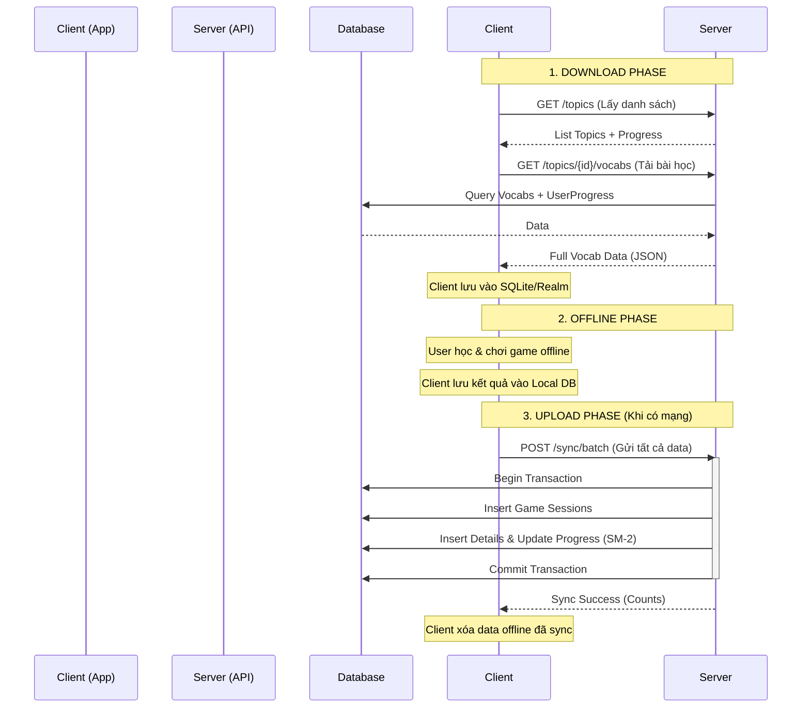

# 🔄 QUY TRÌNH ĐỒNG BỘ DỮ LIỆU OFFLINE (OFFLINE SYNC PROCESS)

Tài liệu này mô tả chi tiết quy trình đồng bộ dữ liệu giữa Client (Mobile App) và Server trong chế độ Offline Mode, dựa trên `OfflineSyncController`.

---

## 1. 🎯 MỤC TIÊU

Hệ thống hỗ trợ người dùng học tập và chơi game ngay cả khi không có kết nối Internet. Khi có mạng trở lại, dữ liệu sẽ được đồng bộ hai chiều:

1.  **Download (Pull):** Tải dữ liệu từ vựng, topic và tiến độ học từ Server về Client.
2.  **Upload (Push):** Gửi kết quả chơi game và tiến độ học offline từ Client lên Server.

---

## 2. 📥 QUY TRÌNH DOWNLOAD (SERVER → CLIENT)

Client chủ động gọi các API sau để lấy dữ liệu về máy.

### 2.1. Tải danh sách Topic & Tiến độ

-   **API:** `GET /api/v1/offline/topics`
-   **Mục đích:** Hiển thị danh sách các chủ đề để người dùng chọn tải về.
-   **Dữ liệu trả về:**
    -   Thông tin Topic (ID, Name, Image).
    -   Tiến độ học (Số từ đã học, % hoàn thành).

### 2.2. Tải chi tiết Từ vựng của Topic

-   **API:** `GET /api/v1/offline/topics/{topicId}/vocabs`
-   **Mục đích:** Tải toàn bộ nội dung bài học của một chủ đề cụ thể.
-   **Dữ liệu trả về:**
    -   **Vocab Info:** Word, Meaning, Transcription, Audio URL, Image URL, Example.
    -   **User Progress:** Status (New/Learning/Mastered), Last Reviewed Date, Next Review Date, Ease Factor (SM-2).

### 2.3. Tải từ vựng đang học (Quick Sync)

-   **API:** `GET /api/v1/offline/vocabs/recent`
-   **Mục đích:** Chỉ tải những từ vựng người dùng đã tương tác trong 30 ngày qua để ôn tập nhanh, tiết kiệm băng thông so với tải full topic.

### 2.4. Kiểm tra cập nhật (Smart Sync)

-   **API:** `GET /api/v1/offline/check-updates`
-   **Tham số:** `lastSyncTime` (Thời gian đồng bộ cuối cùng của Client).
-   **Logic:** Server kiểm tra xem có từ vựng nào mới được thêm vào hoặc sửa đổi sau thời gian `lastSyncTime` hay không.
-   **Kết quả:** Trả về `true/false` và số lượng bản ghi mới. Client dựa vào đây để quyết định có cần tải lại dữ liệu hay không.

---

## 3. 📤 QUY TRÌNH UPLOAD (CLIENT → SERVER)

Khi có mạng, Client sẽ gửi dữ liệu offline lên Server. Hệ thống ưu tiên sử dụng **Batch Sync** để đảm bảo tính toàn vẹn dữ liệu.

### 3.1. Batch Sync (Khuyên dùng)

-   **API:** `POST /api/v1/offline/sync/batch` (hoặc `/sync/complete`)
-   **Mô tả:** Gửi TẤT CẢ dữ liệu offline trong một request duy nhất.
-   **Cấu trúc Request:**
    1.  `gameSessions`: Danh sách các lượt chơi game (thời gian bắt đầu, kết thúc, điểm số).
    2.  `gameSessionDetails`: Chi tiết từng câu trả lời (đúng/sai, thời gian trả lời) của các session trên.
    3.  `userVocabProgress`: Các thay đổi thủ công về tiến độ học (nếu có).

### 3.2. Xử lý Logic tại Server (Transaction Flow)

Khi nhận được request Batch Sync, Server thực hiện theo trình tự sau trong một Database Transaction:

1.  **Lưu Game Sessions:**

    -   Kiểm tra trùng lặp (Idempotency) dựa trên `sessionId` (UUID do Client sinh ra).
    -   Nếu session đã tồn tại -> Bỏ qua hoặc Update tùy logic (thường là bỏ qua để tránh duplicate).
    -   Nếu chưa tồn tại -> Insert vào bảng `game_session`.

2.  **Lưu Game Session Details:**

    -   Lưu từng câu trả lời vào bảng `game_session_detail`.
    -   **Tự động tính toán tiến độ (Auto-calculate Progress):**
        -   Nếu trả lời **ĐÚNG**: Tăng `timesCorrect`, chạy thuật toán SM-2 để tính ngày ôn tập tiếp theo.
        -   Nếu trả lời **SAI**: Tăng `timesWrong`, reset tiến độ về đầu.
        -   Cập nhật trạng thái từ vựng (ví dụ: từ `NEW` -> `LEARNING`).

3.  **Merge User Vocab Progress:**

    -   Nếu Client gửi kèm `userVocabProgress` (tiến độ offline), Server sẽ so sánh với dữ liệu hiện tại.
    -   **Conflict Resolution:** Thường ưu tiên dữ liệu mới nhất (Last Write Wins) hoặc ưu tiên dữ liệu từ Server nếu có xung đột phức tạp.

4.  **Phản hồi:**
    -   Trả về số lượng bản ghi đã đồng bộ thành công (`syncedGameSessions`, `syncedGameSessionDetails`, `syncedVocabProgress`).
    -   Client nhận phản hồi thành công -> Xóa dữ liệu offline đã sync để giải phóng bộ nhớ.

---

## 4. 🔄 SƠ ĐỒ TỔNG QUÁT

---

## 5. 💡 CÁC LƯU Ý QUAN TRỌNG

1.  **UUID:** Client phải tự sinh UUID cho `gameSessionId` để đảm bảo tính duy nhất khi sync lên Server.
2.  **Idempotency:** API được thiết kế để có thể gọi nhiều lần mà không gây lỗi trùng lặp dữ liệu (nếu mạng chập chờn, Client gửi lại request cũ thì Server vẫn xử lý đúng).
3.  **Transaction:** Batch Sync chạy trong 1 transaction. Nếu lỗi ở bất kỳ bước nào, toàn bộ dữ liệu sẽ rollback để đảm bảo không bị "sync nửa vời".
