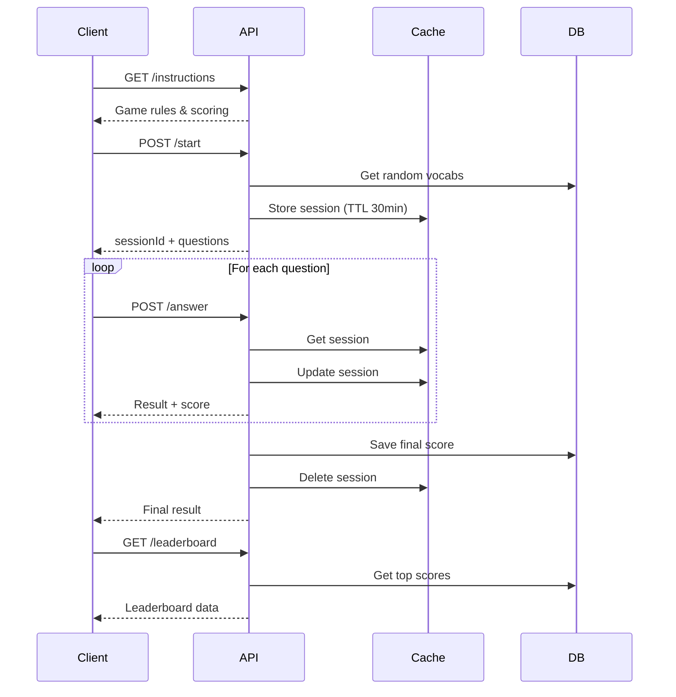

# Quick Quiz API - Hướng Dẫn Sử Dụng

## Tổng Quan

Quick Quiz (Quick Reflex Quiz) là game trắc nghiệm nhanh với 4 đáp án Multiple Choice. Người chơi có thời gian giới hạn (mặc định 3 giây) để trả lời mỗi câu hỏi.

**Base URL:** `/api/v1/games/quick-quiz`

**Authentication:** Bearer Token (JWT) - Required cho tất cả API trừ `/instructions`

---

## Các API Endpoints

### 1. Lấy Hướng Dẫn Chơi Game

**GET** `/api/v1/games/quick-quiz/instructions`

Lấy thông tin chi tiết về cách chơi và cách tính điểm.

#### Request

```http
GET /api/v1/games/quick-quiz/instructions
```

**Headers:** Không cần authentication

#### Response Success (200 OK)

```json
{
    "status": "success",
    "message": "Hướng dẫn game",
    "data": {
        "gameName": "Quick Reflex Quiz - Trắc nghiệm phản xạ nhanh",
        "description": "Game Multiple Choice: Kiểm tra phản xạ và độ nhạy từ vựng của bạn!",
        "howToPlay": "1. Xem từ vựng (tiếng Anh)\n2. Chọn 1 trong 4 nghĩa tiếng Việt đúng nhất\n3. Bạn có 3 giây để trả lời mỗi câu\n4. Hoàn thành 10 câu hỏi liên tục không dừng\n5. Topic được chọn ngẫu nhiên (không cần nhập)",
        "scoring": "• Trả lời đúng: +10 điểm\n• Combo 3+ câu đúng liên tiếp: +5 điểm/combo\n• Trả lời nhanh (<1.5s): +5 điểm bonus\n• Trả lời sai: 0 điểm, mất combo",
        "tips": "Mẹo:\n• Đọc kỹ 4 đáp án trước khi chọn\n• Giữ combo để nhân điểm\n• Trả lời nhanh để được speed bonus\n• Học từ vựng thường xuyên để đạt độ chính xác cao"
    }
}
```

---

### 2. Bắt Đầu Game Quick Quiz

**POST** `/api/v1/games/quick-quiz/start`

Tạo phiên chơi mới với các câu hỏi Multiple Choice (4 đáp án). Tất cả câu hỏi sẽ được tạo sẵn và cache trong bộ nhớ khi game bắt đầu.

#### Request

```http
POST /api/v1/games/quick-quiz/start
Authorization: Bearer {access_token}
Content-Type: application/json
```

**Body:**

```json
{
    "totalQuestions": 10,
    "timePerQuestion": 3,
    "cefr": "B1"
}
```

**Tham số:**

-   `totalQuestions` (optional): Số lượng câu hỏi (5-50, default: 10)
-   `timePerQuestion` (optional): Thời gian mỗi câu (1-10 giây, default: 3)
-   `cefr` (optional): Cấp độ CEFR để lọc từ vựng (A1, A2, B1, B2, C1, C2). Nếu không truyền, hệ thống sẽ lấy từ tất cả cấp độ

**Lưu ý:**

-   Không hỗ trợ chọn chủ đề (topic). Từ vựng được chọn ngẫu nhiên từ database
-   Hệ thống cần `totalQuestions * 4` từ vựng để tạo câu hỏi (1 từ đúng + 3 từ gây nhiễu)
-   Tất cả câu hỏi được cache trong bộ nhớ (ConcurrentHashMap), không lưu Redis

#### Response Success (201 Created)

```json
{
    "status": "success",
    "message": "Bắt đầu game thành công!",
    "data": {
        "sessionId": 1234,
        "gameType": "Quick Reflex Quiz",
        "status": "IN_PROGRESS",
        "totalQuestions": 10,
        "timePerQuestion": 3,
        "currentQuestionNumber": 1,
        "correctCount": 0,
        "wrongCount": 0,
        "currentStreak": 0,
        "longestStreak": 0,
        "totalScore": 0,
        "accuracy": 0.0,
        "averageTimePerQuestion": 0,
        "startedAt": "2025-01-28T10:00:00",
        "finishedAt": null,
        "totalDuration": null,
        "currentQuestion": {
            "sessionId": 1234,
            "questionNumber": 1,
            "vocabId": "550e8400-e29b-41d4-a716-446655440000",
            "word": "abandon",
            "transcription": "/əˈbændən/",
            "options": ["từ bỏ, bỏ rơi", "đạt được", "giành được", "thích nghi"],
            "correctAnswerIndex": null,
            "timeLimit": 3,
            "cefr": "B1",
            "img": "https://example.com/abandon.jpg",
            "audio": "https://example.com/abandon.mp3"
        },
        "results": null
    }
}
```

**Quan trọng:**

-   `correctAnswerIndex` luôn là `null` trong response gửi cho client (để tránh gian lận)
-   Câu hỏi đầu tiên được trả về ngay trong response để client có thể hiển thị
-   Cache được lưu với key: `sessionQuestionsCache.put(sessionId, allQuestions)`

---

### 3. Trả Lời Câu Hỏi

**POST** `/api/v1/games/quick-quiz/answer`

Gửi câu trả lời cho một câu hỏi trong phiên game.

#### Request

```http
POST /api/v1/games/quick-quiz/answer
Authorization: Bearer {access_token}
Content-Type: application/json
```

**Body:**

```json
{
    "sessionId": "12345",
    "questionNumber": 1,
    "selectedVocabId": "uuid-1234",
    "timeTaken": 1200
}
```

**Tham số:**

-   `sessionId` (required): ID của phiên game
-   `questionNumber` (required): Số thứ tự câu hỏi (1-based)
-   `selectedVocabId` (required): UUID của vocab được chọn
-   `timeTaken` (required): Thời gian trả lời (milliseconds)

#### Response Success (200 OK)

**Câu trả lời đúng:**

```json
{
    "correct": true,
    "correctVocabId": "uuid-1234",
    "explanation": "Đáp án đúng!",
    "points": 15,
    "streak": 1,
    "speedBonus": 5,
    "totalScore": 15,
    "isGameComplete": false
}
```

**Câu trả lời sai:**

```json
{
    "correct": false,
    "correctVocabId": "uuid-1234",
    "explanation": "Đáp án đúng là: abandon (từ bỏ, bỏ rơi)",
    "points": 0,
    "streak": 0,
    "speedBonus": 0,
    "totalScore": 15,
    "isGameComplete": false
}
```

**Game hoàn thành (câu cuối cùng):**

```json
{
    "correct": true,
    "correctVocabId": "uuid-1234",
    "explanation": "Hoàn thành game!",
    "points": 10,
    "streak": 3,
    "speedBonus": 0,
    "totalScore": 150,
    "isGameComplete": true,
    "finalResult": {
        "totalQuestions": 10,
        "correctAnswers": 8,
        "wrongAnswers": 2,
        "finalScore": 150,
        "accuracy": 80.0,
        "maxStreak": 5
    }
}
```

#### Response Errors

**Session không tồn tại (404):**

```json
{
    "error": "Session not found",
    "message": "Phiên game không tồn tại hoặc đã hết hạn"
}
```

**Session đã hết hạn (400):**

```json
{
    "error": "Session expired",
    "message": "Phiên game đã hết hạn. Cache TTL = 30 phút"
}
```

---

### 4. Lấy Bảng Xếp Hạng

**GET** `/api/v1/games/quick-quiz/leaderboard`

Lấy danh sách top người chơi có điểm cao nhất trong Quick Quiz.

#### Request

```http
GET /api/v1/games/quick-quiz/leaderboard?limit=100
Authorization: Bearer {access_token}
```

**Query Parameters:**

-   `limit` (optional): Số lượng top players (default: 100, max: 100)

#### Response Success (200 OK)

```json
[
    {
        "rank": 1,
        "userName": "Nguyễn Văn A",
        "avatar": "https://example.com/avatar1.jpg",
        "totalScore": 500,
        "accuracy": 95.5,
        "gamesPlayed": 10,
        "lastPlayedAt": "2025-10-28T10:30:00"
    },
    {
        "rank": 2,
        "userName": "Trần Thị B",
        "avatar": "https://example.com/avatar2.jpg",
        "totalScore": 480,
        "accuracy": 92.0,
        "gamesPlayed": 12,
        "lastPlayedAt": "2025-10-28T09:15:00"
    }
]
```

**Lưu ý:**

-   Người chơi hiện tại sẽ được highlight (nếu có trong top)
-   Bảng xếp hạng được sắp xếp theo: Score (giảm dần) → Accuracy (giảm dần)
-   Mỗi user chỉ xuất hiện 1 lần với điểm cao nhất

---

## Cơ Chế Tính Điểm

### Base Points (Điểm Cơ Bản)

-   **10 điểm** cho mỗi câu trả lời đúng
-   **0 điểm** cho câu trả lời sai

### Streak Bonus (Điểm Combo)

-   Trả lời đúng liên tiếp 3 câu: **+5 điểm** (tổng 35 điểm cho 3 câu)
-   Trả lời đúng liên tiếp 6 câu: **+10 điểm** (tổng 70 điểm cho 6 câu)
-   Streak bị reset về 0 khi trả lời sai

**Công thức:**

```
streakBonus = (currentStreak / 3) * 5
```

### Speed Bonus (Điểm Tốc Độ)

-   Trả lời đúng trong **< 1.5 giây**: **+5 điểm**
-   Trả lời từ 1.5 giây trở lên: **0 điểm speed bonus**

**Lưu ý:** Speed bonus chỉ được tính khi câu trả lời ĐÚNG

### Tổng Điểm

```
Total Score = Base Points + Streak Bonus + Speed Bonus

Ví dụ:
- Câu 1: Đúng, 1.2s → 10 + 0 + 5 = 15 điểm
- Câu 2: Đúng, 2.0s → 10 + 0 + 0 = 10 điểm
- Câu 3: Đúng, 0.9s → 10 + 5 + 5 = 20 điểm (streak = 3)
- Câu 4: Sai → 0 điểm, streak reset về 0
```

---

## Thống Kê Game

### Accuracy (Độ Chính Xác)

```
Accuracy = (Correct Answers / Total Questions) * 100%
```

### Max Streak

-   Số câu trả lời đúng liên tiếp cao nhất trong game
-   Được lưu trong session để tracking

### Duration (Thời Gian Chơi)

-   Tính từ lúc bắt đầu đến khi trả lời câu cuối cùng
-   Đơn vị: giây

---

## Luồng Chơi Game



---

## Cache Management

### Session Cache

-   **Key Pattern:** `quick_quiz:session:{sessionId}`
-   **TTL:** 30 phút
-   **Data Structure:**

```json
{
  "sessionId": "12345",
  "userId": "uuid-user",
  "questions": [...],
  "currentQuestion": 3,
  "correctAnswers": 2,
  "wrongAnswers": 1,
  "totalScore": 35,
  "currentStreak": 2,
  "maxStreak": 3,
  "startedAt": "2025-10-28T10:00:00"
}
```

### Cache Expiration Handling

**Khi session hết hạn:**

1. Client gửi request với `sessionId`
2. API check cache → không tìm thấy
3. API trả về error 400: "Session expired"
4. Client hiển thị thông báo và redirect về trang chủ

**Giải pháp:**

-   **Option 1:** Tăng TTL lên 60 phút
-   **Option 2:** Lưu session vào Database song song với Cache
-   **Option 3:** Sử dụng Redis Persistent Cache

---

## 📝 Ví Dụ Hoàn Chỉnh

### Sử dụng cURL

#### 1. Start Game

```bash
curl -X POST http://localhost:8080/api/v1/games/quick-quiz/start \
  -H "Authorization: Bearer YOUR_TOKEN" \
  -H "Content-Type: application/json" \
  -d '{
    "totalQuestions": 5,
    "topicId": null,
    "cefr": "B1"
  }'
```

#### 2. Answer Question

```bash
curl -X POST http://localhost:8080/api/v1/games/quick-quiz/answer \
  -H "Authorization: Bearer YOUR_TOKEN" \
  -H "Content-Type: application/json" \
  -d '{
    "sessionId": "12345",
    "questionNumber": 1,
    "selectedVocabId": "uuid-1234",
    "timeTaken": 1200
  }'
```

#### 3. Get Leaderboard

```bash
curl -X GET "http://localhost:8080/api/v1/games/quick-quiz/leaderboard?limit=10" \
  -H "Authorization: Bearer YOUR_TOKEN"
```

---

## UI/UX Recommendations

### Hiển thị câu hỏi

-   Hiển thị `questionNumber/totalQuestions` (VD: "3/10")
-   Countdown timer 3 giây với animation
-   Hiển thị từ vựng và 4 options được shuffle
-   Disable buttons khi đã chọn đáp án

### Feedback trả lời

-   Màu xanh cho đáp án đúng
-   Màu đỏ cho đáp án sai
-   Hiển thị điểm số ngay lập tức (+15, +10, etc.)
-   Hiển thị streak indicator (x3)
-   Animation cho speed bonus (+5)

### Kết quả cuối game

-   Total Score (lớn, nổi bật)
-   Accuracy % với progress bar
-   Correct/Wrong answers
-   Max streak achieved
-   Button "Play Again" và "View Leaderboard"

---

## Related APIs

-   **Game History:** `GET /api/v1/users/games/history?gameId=1`
-   **Game Stats:** `GET /api/v1/users/games/stats`
-   **User Profile:** `GET /api/v1/users/profile`
